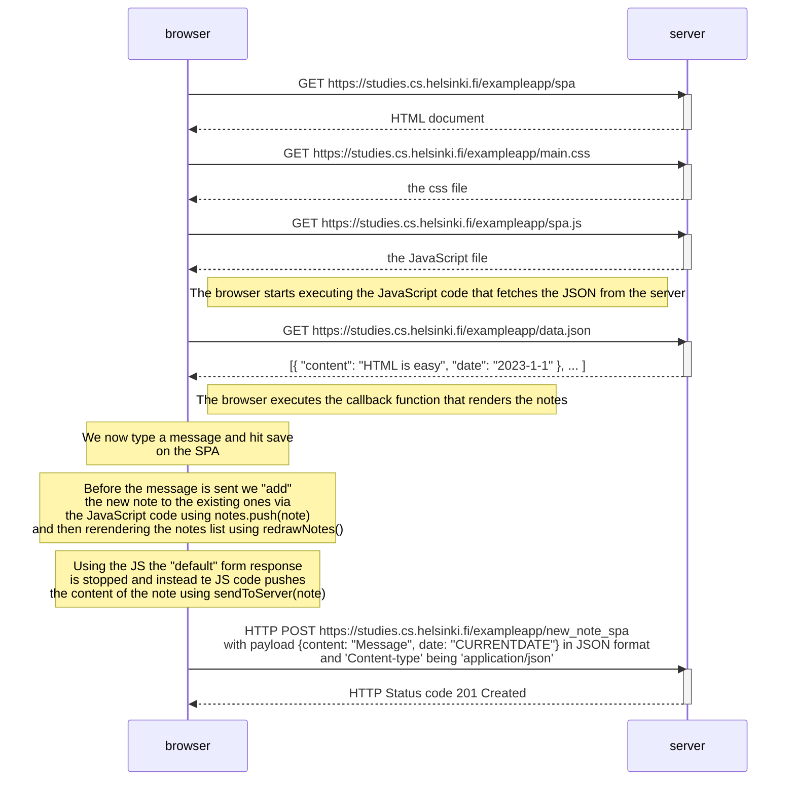

```mermaid
sequenceDiagram
    participant browser
    participant server

    browser->>server: GET https://studies.cs.helsinki.fi/exampleapp/spa
    activate server
    server-->>browser: HTML document
    deactivate server

    browser->>server: GET https://studies.cs.helsinki.fi/exampleapp/main.css
    activate server
    server-->>browser: the css file
    deactivate server

    browser->>server: GET https://studies.cs.helsinki.fi/exampleapp/spa.js
    activate server
    server-->>browser: the JavaScript file
    deactivate server

    Note right of browser: The browser starts executing the JavaScript code that fetches the JSON from the server

    browser->>server: GET https://studies.cs.helsinki.fi/exampleapp/data.json
    activate server
    server-->>browser: [{ "content": "HTML is easy", "date": "2023-1-1" }, ... ]
    deactivate server

    Note right of browser: The browser executes the callback function that renders the notes
    Note over browser: We now type a message and hit save <br/> on the  SPA 
    Note over browser: Before the message is sent we  "add" <br/> the new note to the existing ones via<br/> the JavaScript code using notes.push(note)<br/> and then rerendering the notes list using redrawNotes()
   
    Note over browser: Using the JS the "default" form response <br/> is stopped and instead te JS code pushes <br/> the content of the note using sendToServer(note)
    browser->>server: HTTP POST https://studies.cs.helsinki.fi/exampleapp/new_note_spa <br/>with payload {content: "Message", date: "CURRENTDATE"} in JSON format<br/> and 'Content-type' being 'application/json'
    activate server
    server-->>browser: HTTP Status code 201 Created
    deactivate server
    
```